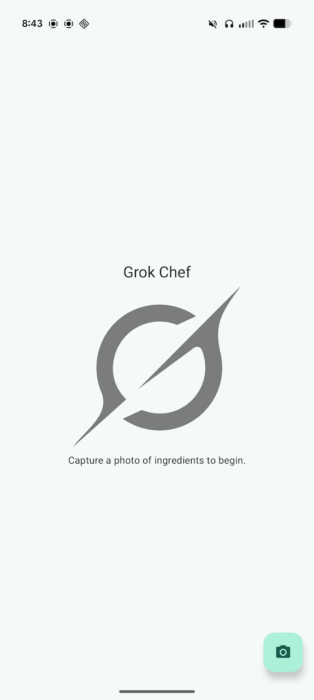

# GrokChef Android Application

Capture a camera photo of food ingredients to generate a list of ingredients to then discover recipes to cook using those ingredients.

A simple proof-of-concept Android application to utilize X.AI Apis (image understanding and live search).
Building using modern Android development tools such as Jetpack Compose, Android Jetpack, and Kotlin.

## Demo

[](demo-video.mp4)

## Build Instructions

In order to build the application to access X.AI APIs, you will need to signup for an account on https://x.ai/, generate an API key, and include it to your project.

### Setting up X.AI API Key

In the root project directory, include your X.AI API in `local.properties` file named as `xai.api.key`:

```
# local.properties
xai.api.key=YOUR_API_KEY
```

**Important: Remember to exclude your API key from version control!** You can do this by adding the following line to your root `.gitignore`:

```
# .gitignore
/local.properties
```